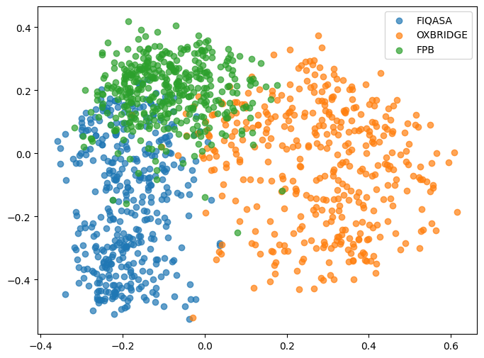

# Financial Sentiment Analysis
## Dataset
* Oxbrige Sentimental Analysis Dataset: The whole unprocessed dataset is saved in `data/sentences.csv` with the processed data in `data/train_easy.csv` and `data/train_hard.csv`. The `train_easy` dataset contains 310 easier data points (that Yingxian and Zhang Kai agree with) and the `train_hard` dataset contains 100 harder data points (that Yingxian and Zhang Kai disagree with and Qingyi dives deeper into).
* [Financial PhraseBank (FPB) Dataset](https://huggingface.co/datasets/takala/financial_phrasebank): Polar sentiment dataset of sentences from financial news. The dataset consists of 4840 sentences from English language financial news categorised by sentiment. The dataset is divided by agreement rate of 5-8 annotators. We use the `sentences_allagree` split, which contains 2264 sentences with 100% annotator agreement.
* [Financial Question Answering - Sentiment Analysis (FIQASA) Dataset](https://huggingface.co/datasets/TheFinAI/flare-fiqasa): a specialized resource designed for financial sentiment analysis and question-answering tasks. It focuses on analyzing sentiment in financial texts, such as news headlines and microblogs, and provides annotated data for training and evaluating models in the financial domain. We utilize the `test` split for evaluation.

## Models
* [NLTK](https://www.nltk.org/api/nltk.sentiment.sentiment_analyzer.html): A pre-trained sentiment analysis VADER (Valence Aware Dictionary and sEntiment Reasoner), which is specifically attuned to sentiments expressed in **social media**. Refer to `nltk.ipynb`
* [FinBERT](https://github.com/ProsusAI/finBERT): FinBERT is a finance-specific adaptation of the BERT model, fine-tuned for analyzing financial texts like news and reports. It excels in tasks such as sentiment analysis and classification, offering enhanced understanding of financial jargon and market trends, making it a valuable tool for finance professionals. Refer to `finbert.ipynb`
* [FinMA](https://github.com/The-FinAI/PIXIU): we use [vLLM](https://github.com/vllm-project/vllm) for fast inference for LLMs as shown in `run_vllm.py`. Note that you need CUDA of around 20GB to inference a 7B model efficiently.
    - `TheFinAI/finma-7b-nlp`
* [FinGPT](https://github.com/AI4Finance-Foundation/FinGPT): refer to `run_vllm_lora.py`
    - `FinGPT/fingpt-sentiment_llama2-13b_lora`: Llama2-13b finetuned with the LoRA on the News and Tweets sentiment analysis dataset which achieve the best scores on most of the financial sentiment analysis datasets with low cost.
    - `FinGPT/fingpt-mt_llama2-7b_lora`: Llama2-7b finetuned with the LoRA on multi-task financial datasets. 
* GPT-4O mini: we use the Azure API for inference in `openai.ipynb`.
* [DeepSeek](https://www.deepseek.com): we use the OpenAI API for inference in `openai.ipynb`.

## Results
After you get the inferece result from the models, you may use the `eval.ipynb` to generate the accuracy table. By default, the result will be saved in `data/results.md`.

| Model | FPB | FIQASA | OXBRIDGE_EASY | OXBRIDGE_HARD |
|-------|-----|-----|-----|-----|
| NLTK | 0.2155 | 0.3957 | 0.3786 | 0.4400 | 
| fingpt-sentiment_llama2-13b_lora | 0.9947 | 0.9532 | 0.7573 | 0.5200 | 
| finbert | 0.9691 | 0.5447 | 0.6958 | 0.4100 | 
| deepseek | 0.9510 | 0.6468 | 0.8317 | 0.5500 | 
| openai | 0.9523 | 0.6851 | 0.8641 | 0.6200 | 
| fingpt-mt_llama2-7b_lora | 0.6343 | 0.9277 | 0.7832 | 0.5500 | 
| finma-7b-nlp | 0.8679 | 0.7149 | 0.7152 | 0.5400 | 

## Analysis
